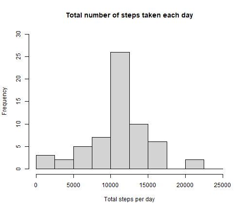

# Step 1
### Loading and preprocessing the data
Code for reading in the dataset and/or processing the data

```r
library(ggplot2)
activity <- read.csv("activity.csv")
```
Exploring the basics of this data

```r
dim(activity)
```

```
## [1] 17568     3
```

```r
names(activity)
```

```
## [1] "steps"    "date"     "interval"
```

```r
head(activity)
```

```
##   steps       date interval
## 1    NA 2012-10-01        0
## 2    NA 2012-10-01        5
## 3    NA 2012-10-01       10
## 4    NA 2012-10-01       15
## 5    NA 2012-10-01       20
## 6    NA 2012-10-01       25
```

```r
summary(activity)
```

```
##      steps            date              interval     
##  Min.   :  0.00   Length:17568       Min.   :   0.0  
##  1st Qu.:  0.00   Class :character   1st Qu.: 588.8  
##  Median :  0.00   Mode  :character   Median :1177.5  
##  Mean   : 37.38                      Mean   :1177.5  
##  3rd Qu.: 12.00                      3rd Qu.:1766.2  
##  Max.   :806.00                      Max.   :2355.0  
##  NA's   :2304
```
# Step 2
### Histogram of the total number of steps taken each day

```r
activity_total_steps <- with(activity, aggregate(steps, by = list(date), FUN = sum, na.rm = TRUE))
names(activity_total_steps) <- c("date", "steps")
```

```r
hist(activity_total_steps$steps, 
     main = "Total number of steps taken per day", 
     xlab = "Total steps taken per day",
     ylim = c(0,20), 
     breaks = seq(0,25000, by=2500))
```


# Step 3                       
### What is mean total number of steps taken per day?
### Mean and median number of steps taken each day

```r
mean(activity_total_steps$steps)
```

```
## [1] 9354.23
```

```r
median(activity_total_steps$steps)
```

```
## [1] 10395
```
# Step 4                           
### What is the average daily activity pattern?
### Time series plot of the average number of steps taken

```r
average_daily_activity <- aggregate(activity$steps, by=list(activity$interval), FUN=mean, na.rm=TRUE)
names(average_daily_activity) <- c("interval", "mean")
```

```r
plot(average_daily_activity$interval, 
     average_daily_activity$mean, 
     type = "l",
     xlab="Interval", 
     ylab="Average number of steps", 
     main="Average number of steps per intervals")
```


# Step 5
### Code to describe and show a strategy for imputing missing data

```r
sum(is.na(activity$steps))
```

```
## [1] 2304
```

```r
imputed_steps <- average_daily_activity$mean[match(activity$interval, average_daily_activity$interval)]
activity_imputed <- transform(activity, steps = ifelse(is.na(activity$steps), yes = imputed_steps, no = activity$steps))
total_steps_imputed <- aggregate(steps ~ date, activity_imputed, sum)
names(total_steps_imputed) <- c("date", "daily_steps")
```
# Step 6
### Histogram of the total number of steps taken each day after missing values are imputed       

```r
hist(total_steps_imputed$daily_steps, 
      xlab = "Total steps per day", 
      ylim = c(0,30), 
      main = "Total number of steps taken each day", 
     breaks = seq(0,25000,by=2500))
```


      
# Step 7
### Panel plot comparing the average number of steps taken per 5-minute interval across weekdays and weekends                      

```r
activity$date <- as.Date(strptime(activity$date, format="%Y-%m-%d"))
activity$datetype <- sapply(activity$date, function(x) {
  if (weekdays(x) == "sabato" | weekdays(x) =="domenica") 
  {y <- "Weekend"} else 
  {y <- "Weekday"}
  y
})
```
    
# Step 8
### All of the R code needed to reproduce the results (numbers, plots, etc.) in the report

```r
activity_by_date <- aggregate(steps~interval + datetype, activity, mean, na.rm = TRUE)
```

```r
ggplot(activity_by_date, aes(x = interval , y = steps, color = datetype)) +
       geom_line() +
       labs(title = "Average daily steps by type of date", x = "Interval", y = "Average number of steps") +
       facet_wrap(~datetype, ncol = 1, nrow=2)
```


    
